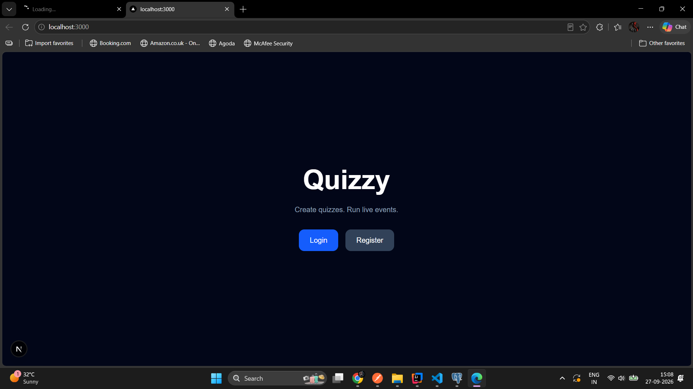
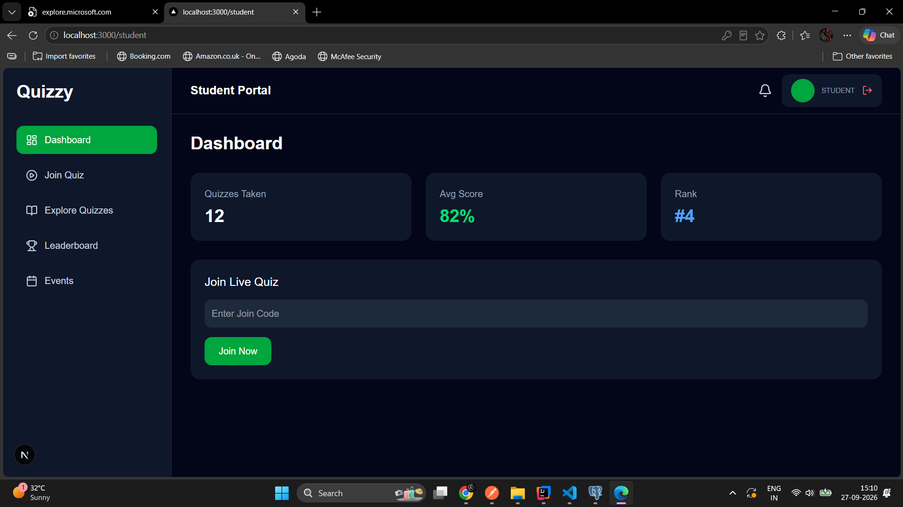
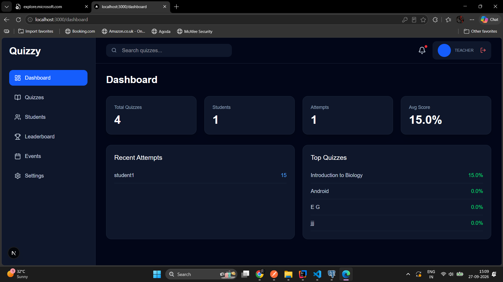
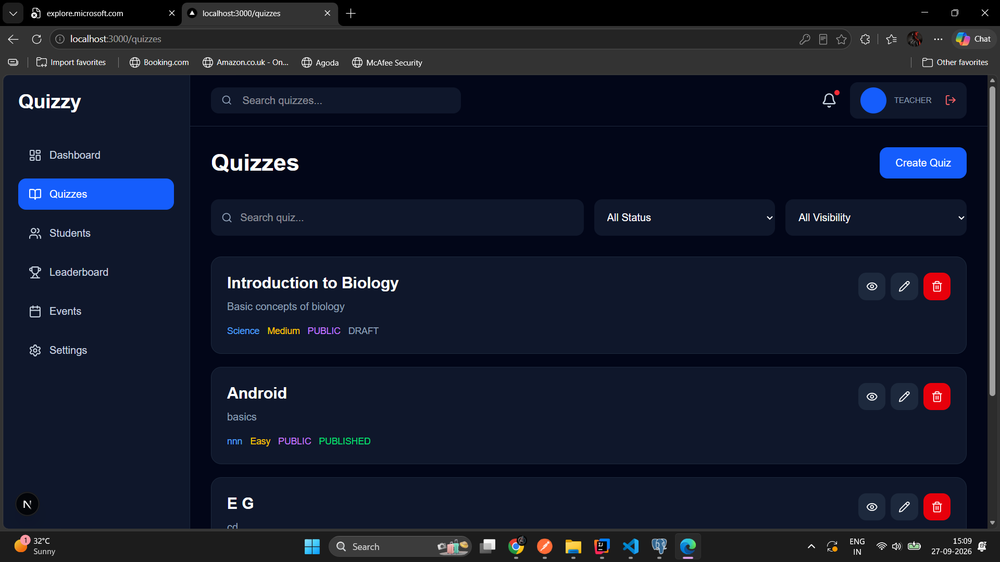
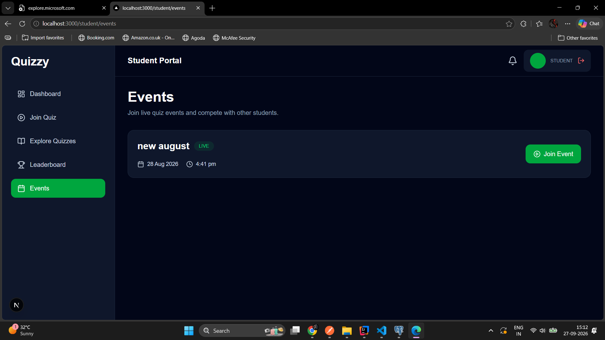
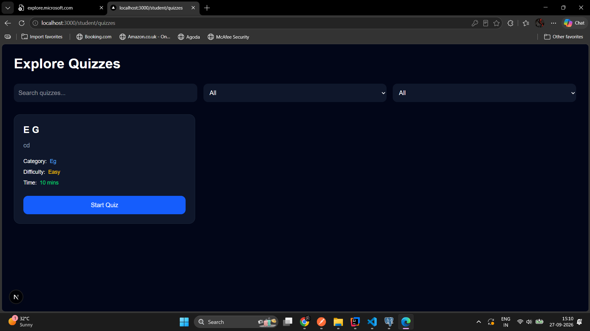
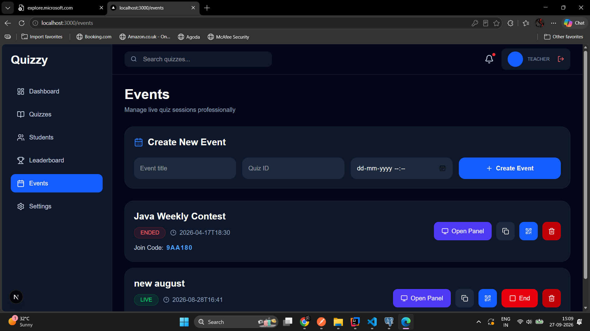
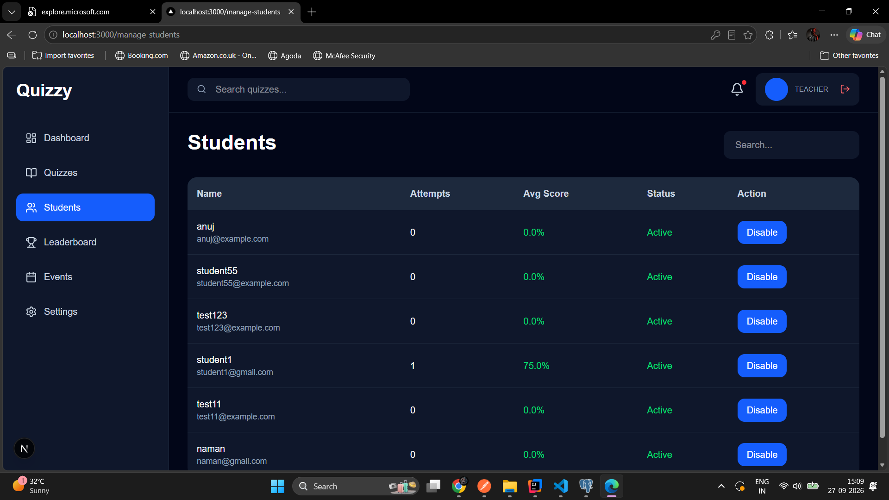

# Quiz Web App

A full-stack online quiz platform built with **Spring Boot**, **Next.js**, **TypeScript**, **MySQL**, and **JWT authentication**.

The application provides separate experiences for **Admin, Teacher, and Student** users. Teachers can create quizzes and conduct live quiz events, while students can explore quizzes, join live events, answer questions, and view results/leaderboards.

---

## 🚀 Features

### 🔐 Authentication

- User registration
- User login
- JWT-based authentication
- Role-based authorization
- Protected routes
- Separate access for:
  - Admin
  - Teacher
  - Student

---

### 👨‍🏫 Teacher Features

Teachers can:

- Create quizzes
- Edit quizzes
- Delete quizzes
- Publish quizzes
- Save quizzes as drafts
- Set quiz category
- Set quiz difficulty
- Set time limit
- Set passing score
- Enable random questions
- Enable instant results
- Set quiz visibility:
  - Public
  - Private
- Add multiple-choice questions
- Set correct answers
- Set points for each question
- View their quizzes
- Create live quiz events
- Start live events
- End live events
- Generate unique event join codes
- View event participants
- View event leaderboard

---

### 🧑‍🎓 Student Features

Students can:

- Access the student dashboard
- Explore available quizzes
- Start quizzes
- Join live quiz events
- View upcoming events
- View live events
- Answer live quiz questions
- Navigate between questions
- Select answers
- View question progress
- View leaderboards

---

### ⚡ Live Quiz Events

Teachers can create an event from an existing quiz.

Each event contains:

- Event title
- Quiz
- Start time
- Join code
- Event status
- Teacher
- Start/end time

**Event statuses:**

```
SCHEDULED
LIVE
ENDED
```

When a teacher starts an event, the event becomes `LIVE`.

Students can then join the live event and receive the questions.

---

## 🏗️ Project Architecture

The project consists of two main applications:

```
Quiz Web App
│
├── Backend
│   └── Spring Boot
│
└── Frontend
    └── Next.js + TypeScript
```

---

## 🛠️ Technologies Used

### Backend
- Java
- Spring Boot
- Spring Security
- JWT
- Spring Data JPA
- Hibernate
- PostgreSQL
- Lombok
- REST API

### Frontend
- Next.js
- React
- TypeScript
- Tailwind CSS
- Axios
- Lucide React
- React QR Code

### Development Tools
- IntelliJ IDEA
- Visual Studio Code
- Git
- GitHub
- Postman

---

## 📁 Project Structure

### Backend

```
backend/
└── src/
    └── main/
        └── java/
            └── com/
                └── shailesh/
                    └── quizweb/
                        ├── config/
                        ├── controller/
                        ├── dto/
                        ├── entity/
                        ├── enums/
                        ├── repository/
                        ├── security/
                        └── service/
                            └── impl/
```

**Important backend layers:**

```
Controller
    ↓
Service
    ↓
Repository
    ↓
Database
```

### Frontend

```
frontend/
└── app/
    ├── dashboard/
    ├── events/
    ├── leaderboard/
    ├── live/
    ├── login/
    ├── manage-students/
    ├── quizzes/
    ├── register/
    ├── settings/
    │
    └── student/
        ├── events/
        ├── join/
        ├── leaderboard/
        ├── play/
        └── quizzes/
```

Reusable components are stored inside:

```
frontend/
└── components/
```

API services are stored inside:

```
frontend/
└── services/
```

---

## 🔑 Authentication

The application uses JWT authentication. After successful login, the frontend stores the JWT token and attaches it to protected API requests.

**Example:**

```
Authorization: Bearer <JWT_TOKEN>
```

Protected APIs are separated by role:

```
/api/admin/**
/api/teacher/**
/api/student/**
```

---

## 👥 User Roles

### Admin
Admin users can access administrative functionality.
`ROLE_ADMIN`

### Teacher
Teachers can manage quizzes and conduct live events.
`ROLE_TEACHER`

### Student
Students can take quizzes and participate in live events.
`ROLE_STUDENT`

---

## 📝 Quiz Management

A quiz contains information such as:

- Title
- Description
- Category
- Difficulty
- Time Limit
- Passing Score
- Random Questions
- Instant Results
- Status
- Visibility
- Teacher
- Created At

**Quiz status:**
```
DRAFT
PUBLISHED
```

**Quiz visibility:**
```
PUBLIC
PRIVATE
```

---

## ❓ Question Management

Each question contains:

- Question Text
- Option A
- Option B
- Option C
- Option D
- Correct Answer
- Points
- Quiz

**Example:**

```
Question: What is the capital of France?

A. Berlin
B. Madrid
C. Paris
D. Rome

Correct Answer: C
Points: 5
```

> For student live quiz APIs, the correct answer is intentionally **not** returned to the frontend.

---

## 🎯 Student Live Quiz

When a student joins a live event, the application retrieves questions through:

```
GET /api/student/events/{id}/questions
```

The student receives:

- Question
- Option A
- Option B
- Option C
- Option D
- Points

The `correctAnswer` is **not** exposed to the student. This prevents students from seeing the correct answers through the browser's network requests.

---

## 📡 Event APIs

| Action | Endpoint |
|---|---|
| Create Event | `POST /api/teacher/events` |
| Get Teacher Events | `GET /api/teacher/events` |
| Start Event | `PUT /api/teacher/events/{id}/start` |
| End Event | `PUT /api/teacher/events/{id}/end` |
| Student Events | `GET /api/student/events` |
| Join Event | `POST /api/student/events/{id}/join` |
| Student Event Details | `GET /api/student/events/{id}` |
| Student Questions | `GET /api/student/events/{id}/questions` |
| Event Leaderboard | `GET /api/teacher/events/{id}/leaderboard` |

---

## 🏆 Leaderboard

The event leaderboard displays student scores. The backend retrieves results using the quiz associated with the event.

**Example:**

```
Leaderboard

1. Student A       95
2. Student B       90
3. Student C       85
4. Student D       80
```

---

## 📱 Application Screenshots

Add screenshots to a folder such as:

```
screenshots/
```

Recommended structure:

```
screenshots/
├── login.png
├── register.png
├── student-dashboard.png
├── teacher-dashboard.png
├── quiz-list.png
├── create-quiz.png
├── quiz-details.png
├── student-events.png
├── live-event.png
├── teacher-live-panel.png
├── leaderboard.png
└── student-quiz.png
```

### 🔐 Login


### 🧑‍🎓 Student Dashboard


### 👨‍🏫 Teacher Dashboard


### 📝 Quizes Page



### 📅 Student Events


### ⚡ Explore Quiz


### 🎮 Teacher Live Event Panel


### Students


---

## ⚙️ Backend Setup

### 1. Clone the Repository

```bash
git clone <your-github-repository-url>
```

Move into the backend directory:

```bash
cd backend
```

### 2. Configure PostgreSQL

Create a Postgre database:

```sql
CREATE DATABASE quizwebdb;
```

Update the Spring Boot database configuration in:

```
src/main/resources/application.yml
```

**Example:**

```properties
server:
  port: 8080

spring:
  datasource:
    url: jdbc:postgresql://localhost:5432/quizwebdb
    username: postgres
    password: postgres

  jpa:
    hibernate:
      ddl-auto: update
    show-sql: true

jwt:
  secret: mysecretkeymysecretkeymysecretkey
  expiration: 86400000
```

### 3. Run the Backend

Using Maven:

```bash
mvn spring-boot:run
```

The backend runs on:

```
http://localhost:8080
```

---

## 💻 Frontend Setup

Move into the frontend directory:

```bash
cd frontend
```

Install dependencies:

```bash
npm install
```

Run the development server:

```bash
npm run dev
```

The frontend runs on:

```
http://localhost:3000
```

---

## 🔗 Application URLs

| App | URL |
|---|---|
| Frontend | http://localhost:3000 |
| Backend | http://localhost:8080 |
| Backend API | http://localhost:8080/api |

---

## 🔄 Application Flow

### Student Quiz Flow

```
Student Login
      ↓
Student Dashboard
      ↓
Explore Quizzes
      ↓
Select Quiz
      ↓
Start Quiz
      ↓
Answer Questions
      ↓
Submit Quiz
      ↓
Result
```

### Live Event Flow

```
Teacher Login
      ↓
Create Quiz
      ↓
Add Questions
      ↓
Create Event
      ↓
Start Event
      ↓
Event becomes LIVE
      ↓
Student sees LIVE event
      ↓
Student joins event
      ↓
Student receives questions
      ↓
Student answers questions
      ↓
Submit
      ↓
Score / Result
      ↓
Leaderboard
```

---

## 🔐 Security Considerations

The application uses:

- JWT authentication
- Spring Security
- Role-based authorization
- Protected frontend routes
- Protected backend APIs

Student question responses do **not** expose `correctAnswer`. The correct answer remains on the backend for evaluation.

---

## 🔮 Future Improvements

Planned/improvable features include:

- Real-time WebSocket synchronization
- Live event countdown timer
- Automatic event start/end
- Real-time leaderboard updates
- Student participant tracking
- Quiz result analytics
- Teacher analytics dashboard
- Question randomization
- Automatic submission when timer expires
- Event result history
- Improved validation and error handling
- Mobile responsive improvements
- Deployment to cloud hosting

---

## 🧪 Testing

The application can be tested using:

- Browser
- Postman
- Spring Boot application logs
- MySQL database
- Browser Developer Tools

**Example API testing:**

```
POST http://localhost:8080/api/auth/login

GET http://localhost:8080/api/student/events

GET http://localhost:8080/api/student/events/{id}/questions
```

---

## 📌 Current Development Status

The application currently contains the core functionality for:

- Authentication
- Role-based access
- Quiz management
- Question management
- Public/private quizzes
- Student quiz exploration
- Teacher event creation
- Live event management
- Student event listing
- Student event joining
- Live event questions
- Teacher leaderboard
- Student live quiz interface

Further work is focused on completing the live quiz submission, result processing, timer synchronization, and real-time event functionality.

---

## 👨‍💻 Author

**Shailesh**
Full-Stack Quiz Web Application

Built with:
- Java + Spring Boot
- Next.js + TypeScript
- PostgreSQL
- Spring Security + JWT
- Tailwind CSS
